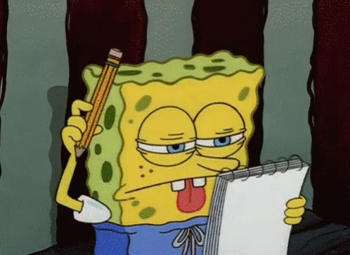
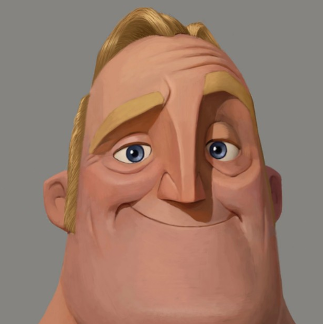

# Welcome to the GUI documentation!

### What's this?

#### -> If you're asking what's a GUI...

The **graphical user interface**, or **GUI** (/ˌdʒiːjuːˈaɪ/ *JEE-yoo-EYE* or /ˈɡuːi/ *GOO-ee*), is a form of user interface that allows users to interact with electronic devices through graphical icons and audio indicator such as primary notation, instead of text-based UIs, typed command labels or text navigation. GUIs were introduced in reaction to the perceived steep learning curve of command-line interfaces (CLIs), which require commands to be typed on a computer keyboard. (copy-pasted from Wikipedia)

#### -> If you're asking why Rick and Morty...

Funy

---

### What do I do now?

Well, I'm not your parent, so do as you please.

But if you want to navigate this documentation, I may be able do help you.

See the 3 buttons at the top? You can just press one of these.

1. **Main Page** is what you're reading at the moment (except if I'm just a memory).
2. **Classes** is where you'll find every class defining objects used in the code (because C++).
3. **Files** lists every header, using the .hpp extension.

---

### Did you like this project?

Yes
